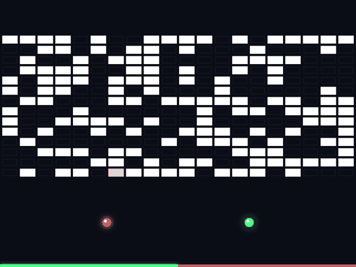

# Brickflux

**Order vs Chaos in your browser. Set the rules, start the round, and see who holds the grid.**

**▶ Play it: [brickflux.vercel.app](https://brickflux.vercel.app/)**

Two balls bounce around a grid of bricks. The red **Breaker** knocks out lit bricks and the green **Builder** lights dark ones back up. When the timer runs out, the Builder wins if more than half the grid is lit. Otherwise the Breaker takes it.

## Features

- **You set the rules.** Sliders for each side's speed, round length and chaos (how much their paths wobble). **Multi** lets a hit spread to neighbouring bricks.
- **Seeded challenge links.** Every round starts from a seeded grid. **Share** copies a link such as `?seed=k3x9q1&breaker=560&builder=300&time=60&chaos=0`. Whoever opens it plays the same grid with the same settings. **Replay This Grid** retries it.
- **Onboarding tour.** First-time visitors get a three-step tour. Returning visitors go straight to a Start button.
- **Pause any time.** A pause button (or **P**) freezes the round, and switching tabs pauses it for you.
- **Lead-change chart.** The result screen plots the share of lit bricks against the 50% line that decides the winner, marks every time the lead switched sides, and lets you read any moment with the pointer or arrow keys.
- **Match history.** A side panel lists past rounds, stored locally in the browser.
- **Keyboard and screen reader friendly.** Labelled controls, focus handling for dialogs and the history panel, and a live region for messages.
- **Physics that doesn't tunnel.** Fast balls are sub-stepped so they can't skip through bricks, and headings are kept off the axes so a ball never gets stuck skimming a wall.

## How it's built

- One file, `index.html`: vanilla JavaScript, Canvas 2D and CSS. No framework, no build step, no dependencies at runtime.
- A tiny seeded PRNG (mulberry32) drives the grid and starting angles, which is what makes share links reproducible.
- Browser tests with Playwright run in GitHub Actions on every pull request and push to `main`. Vercel deploys `main` to production.

## Run it

Open `index.html` in a browser.

## Tests

`npm install` then `npm test` runs the Playwright browser tests (boot, controls, challenge links, physics, timer, onboarding, history panel, accessibility). If Chromium is already installed somewhere, set `CHROMIUM_PATH` to it instead of running `npx playwright install`.

## Preview image and GIF

`og.png` (the link preview) and `brickflux.gif` are captured from a fixed seed. Run `npm run media` to regenerate both after a visual change. The GIF step needs Python 3 with Pillow (`pip install pillow`).
